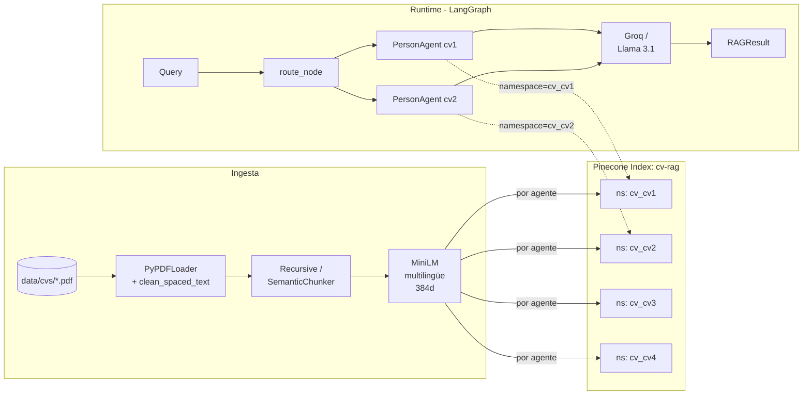
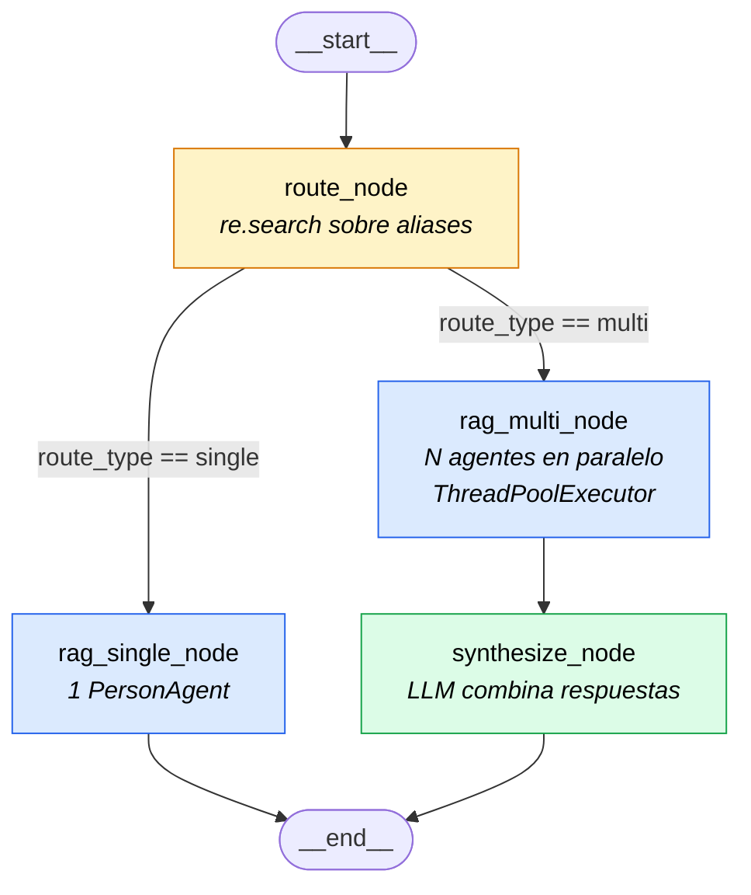

# TP3 — Sistema Multi-Agente RAG sobre CVs

Chatbot basado en **Retrieval-Augmented Generation** con un **agente por candidato**,
orquestado mediante **LangGraph**. Cada agente tiene su propio namespace en Pinecone
y su propio prompt especializado. Partiendo del TP2 (RAG simple), se agrega la capa
multi-agente siguiendo el patrón del repo de referencia.

**Stack:** 

· Pinecone (vector store, un namespace por agente) 
· Groq/Llama 3.1 (LLM) 
· HuggingFace MiniLM multilingüe (embeddings) 
· **LangGraph (orquestación) 
· LangChain (RAG chain) 
· Streamlit (UI).

CEIA — FIUBA · TP3 sobre la clase 6.

---

## Diagrama de flujo




---

## Estructura

```
tp3-multiagent-rag/
├── app.py                    # Streamlit con UI por agente
├── requirements.txt
├── .env.example
├── README.md
├── data/
│   └── cvs/                  # cv1.pdf, cv2.pdf, cv3.pdf, cv4.pdf
└── src/
    ├── __init__.py
    ├── config.py             # config + AGENTS dict (configurar informacion sobre los candidatos )
    ├── ingestion.py          # ingesta por agente --agent {slug|all}
    ├── retriever.py          # retriever scopeado a un namespace
    ├── rag_chain.py          # shim o "puente" de compatibilidad (reexporta run/preload)
    ├── semantic_chunker.py   # SemanticChunker con MiniLM (opcional)
    ├── evaluation.py         # métricas: routing_accuracy + precision/recall/MRR
    └── agents/
        ├── __init__.py
        ├── registry.py       # helpers sobre config.AGENTS
        ├── person_agent.py   # PersonAgent: retriever + prompt + chain por persona
        ├── graph.py          # StateGraph compilado (route / single / multi / synth)
        └── orchestrator.py   # API pública: run() y preload_agents()
```

---

## Setup

```bash
# 1. Virtualenv
python -m venv .venv
source .venv/bin/activate

# 2. Dependencias
pip install -r requirements.txt

# 3. API keys
cp .env.example .env
# editá .env con tus credenciales de Groq y Pinecone
```

---

## Configuración de agentes

Editá `src/config.py` para definir a los candidatos:

```python
AGENTS: dict = {
    "cv1": {
        "display_name": "Ana García",                 # ajustalo al nombre real del CV
        "pdf": "cv1.pdf",
        "aliases": [r"\bana\b", r"\bana\s*garc[ií]a\b", r"\bcv\s*1\b"],
    },
    "cv2": { ... },
    ...
}
DEFAULT_AGENT: str = "cv1"
```

Los `aliases` son **regex** que se evalúan con `re.search(..., re.IGNORECASE)` sobre
la query. Agregá todas las formas en que el usuario podría mencionar a la persona:
nombre, apellido, diminutivos, iniciales, número de CV, etc.

---

## Uso

### 1. Copiar los CVs

```
data/cvs/cv1.pdf
data/cvs/cv2.pdf
data/cvs/cv3.pdf
data/cvs/cv4.pdf
```

### 2. Ingestar cada CV en su propio namespace

```bash
# Todos juntos
python -m src.ingestion --agent all --force

# O uno por uno
python -m src.ingestion --agent cv1 --force
python -m src.ingestion --agent cv2 --force

# Chunking semántico (opcional)
python -m src.ingestion --agent all --force --use-semantic
```

Cada agente queda en el namespace `cv_{slug}` (ej. `cv_cv1`). El flag `--force`
borra los vectores previos del namespace antes de reindexar.

### 3. Levantar la app

```bash
streamlit run app.py
```

### 4. Ejemplos de uso

| Pregunta | Comportamiento |
|---|---|
| *¿Qué experiencia tiene Ana?* | `route_node` matchea `cv1` → `rag_single_node` |
| *¿Y Juan dónde estudió?* | `route_node` matchea `cv2` → `rag_single_node` |
| *Compará la experiencia de Ana y Juan* | matchea `cv1` y `cv2` → `rag_multi_node` + `synthesize_node` |
| *¿Qué lenguajes maneja el candidato?* | no matchea nadie → usa `DEFAULT_AGENT` |

---

## Uso programático

```python
from src.agents.orchestrator import run, preload_agents
from langchain_core.messages import HumanMessage, AIMessage

preload_agents()

# Query simple
results = run("¿Qué experiencia tiene Ana?")
for r in results:
    print(r.display_name, "—", r.answer)

# Query comparativa
results = run("Compará Python entre Ana y Juan")
print(results[0].answer)   # ya viene sintetizada

# Con historial
history = [HumanMessage(content="Háblame de Ana"), AIMessage(content="...")]
results = run("¿Y dónde trabajó antes?", chat_history=history)
```

---

## Evaluación

`src/evaluation.py` expone métricas a nivel **sistema multi-agente**:

| Métrica | Qué mide |
|---|---|
| `routing_accuracy` | El `route_node` selecciona el set de agentes correcto |
| `precision@k` | De los slugs recuperados, fracción que es relevante |
| `recall@k` | De los slugs relevantes, fracción recuperada |
| `MRR` | Posición del primer slug relevante en el ranking |

```python
from src.evaluation import EvalQuery, evaluate_all, summary_metrics

eval_set = [
    EvalQuery(
        question="¿Qué experiencia tiene Ana con Docker?",
        relevant_slugs=["cv1"],
    ),
    EvalQuery(
        question="Compará Ana y Juan en cuanto a lenguajes",
        relevant_slugs=["cv1", "cv2"],
    ),
]
df = evaluate_all(eval_set, k=4)
print(summary_metrics(df, k=4))
```

---

## Decisiones de diseño

- **Pinecone + namespaces vs colecciones Qdrant.** Mantengo Pinecone del TP2 y uso un
  *namespace* por agente (`cv_{slug}`) dentro del mismo índice. Es idéntico
  lógicamente y evita tener que levantar infra local.
- **Groq/Llama 3.1.** Es una configuración híbrida, los vectores se generan localmente -MiniLM- y luego se cargan en Pinecone y se usa una LLM de Groq.
- **Routing por regex, no por LLM.** Es rápido, determinístico y suficiente para nombres de personas. Si hace falta router por LLM para casos ambiguos, se puede sumar una capa 2.
- **PersonAgent con prompt defensivo.** Cada agente tiene instrucción explícita
  de hablar SOLO de su persona aunque la query mencione a otros. La comparación
  la hace `synthesize_node`, no los agentes.
- **Síntesis sobre respuestas, no sobre chunks.** El `synthesize_node` recibe
  lo que cada agente ya dedujo, no los chunks crudos. Esto elimina el riesgo
  de que el LLM mezcle contextos y atribuya mal.
- **ThreadPoolExecutor.** Paralelización simple de las llamadas a Groq. Si se
  hiciera con 10+ agentes en simultáneo habría que cuidar el rate limit del
  free tier (429); con 2-4 no es problema.

---

## Extender: agregar un candidato nuevo

1. Copiar el PDF a `data/cvs/cv5.pdf`.
2. Agregar la entrada en `src/config.py`:
   ```python
   "cv5": {
       "display_name": "María López",
       "pdf": "cv5.pdf",
       "aliases": [r"\bmar[ií]a\b", r"\bl[oó]pez\b", r"\bcv\s*5\b"],
   },
   ```
3. Ingestar: `python -m src.ingestion --agent cv5 --force`.

El router y el grafo lo incorporan automáticamente sin más cambios.